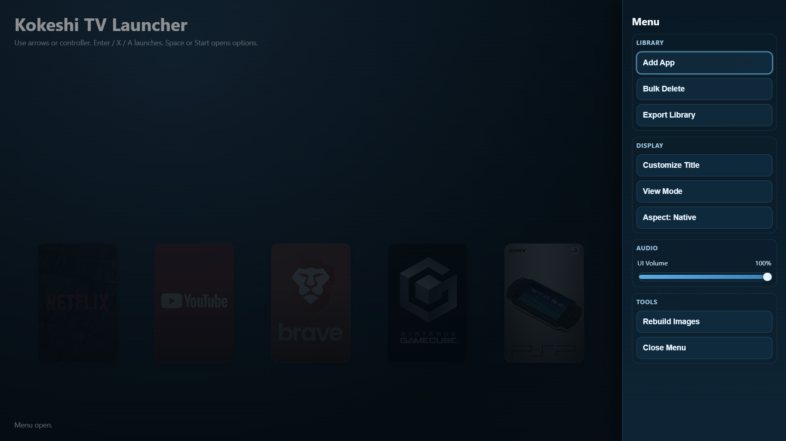

# WinDeckTV-WindowsSmartTVFrontend

A Windows desktop frontend that turns a mini PC or regular PC into a Smart TV style launcher.

This project is focused on a controller-friendly, fullscreen home screen for launching apps, media tools, browser shortcuts, and emulators on Windows.

## Current Status

This project is in active development.

- No official release build is published yet.
- Build and run from source for now.
- Expect occasional UI or behavior changes as features evolve.

## Features

- Fullscreen Smart TV style launcher UI on Windows
- Grid and carousel browsing modes
- Keyboard and gamepad navigation support
- Focus-based background and cover artwork
- In-app Menu with controller-friendly navigation
- UI sound effects with adjustable in-app volume
- Bulk delete flow for managing many entries
- Export library bundle (includes snapshot media data when available)
- Per-app launch path and launch options
- Optional cover and background customization per app

## Usefulness / Usage

This is useful if you want a living-room style interface on a Windows machine without using the normal desktop shell flow.

- Boot a mini PC directly into a TV-like app launcher
- Use a controller/keyboard from couch distance
- Hide desktop complexity for family or guests
- Create a curated media/game launcher experience
- Keep app launching simple and visual

## Typical Use Cases

- HTPC / mini PC connected to a TV
- Windows emulation station frontend
- Family media box with simplified navigation
- Dedicated kiosk-style launcher for living room setups
- Personal Smart TV replacement interface on unused PC hardware

## Screenshots

Put media here: `media/`

### 16:9 Samples


### Menu



### 5:4 Samples


## Setup (Development)

### Prerequisites

- Windows 10/11
- Node.js 18+ and npm
- Rust toolchain (stable)
- Tauri build prerequisites for Windows

### 1. Install dependencies

```powershell
npm install
```

### 2. Ensure Cargo is on PATH for this terminal session

```powershell
$env:Path = "$env:USERPROFILE\.cargo\bin;$env:Path"
```

### 3. Run in development mode

```powershell
npm run tauri dev
```

### 4. Build frontend + desktop app artifacts

```powershell
npm run build
```

Optional Rust-side check:

```powershell
cargo check --manifest-path src-tauri/Cargo.toml
```

## Notes

- This project currently stores launcher data locally.
- Exported library bundles are intended to help migration/backup.
- Import flow and packaged releases are planned improvements.

## Disclaimer

No release binaries are provided at this time.

If you use this project now, you are using a development build from source.
